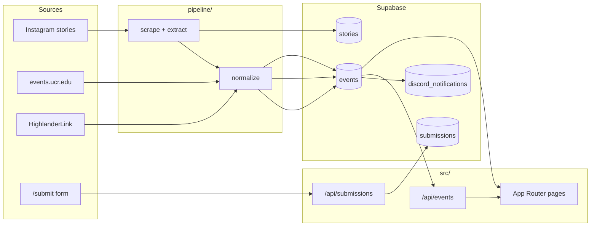

# Architecture

Highlander Hub is a monorepo: a Next.js app, a Python ingest pipeline, and Supabase as the shared database.

## Data flow

1. **Pipeline** (`pipeline/run.py`, scheduled in `.github/workflows/scrape.yml`) scrapes external sources, normalizes rows, and upserts into Postgres. Raw JSON lives under `pipeline/data/` (gitignored).
2. **Schemas** (`schemas/*.upsert.schema.json`) define the row shape both Python mappers and TypeScript must honor. Run `npm run generate:rows` after schema edits.
3. **App** reads `events` via `src/lib/events/` (server) and client fetch helpers in `src/lib/events/api.ts`. Manual submissions post to `/api/submissions`, then land in `submissions` for review.

## Repository layout

| Path | Role |
| --- | --- |
| `src/app/` | Next.js routes, API handlers, route-level `loading` / `error` |
| `src/components/` | UI by feature (`events/`, `forms/submit/`, `home/`, `layout/`, `ui/`) |
| `src/lib/events/` | Event domain: DB reader, API client, feed session/restore, validation |
| `src/lib/` | Cross-cutting helpers (`dates`, `supabase`, `submission-flyer`, …) |
| `src/types/` | Shared TypeScript types |
| `pipeline/` | Python scrapers, extractors, normalizers |
| `supabase/migrations/` | Database source of truth |
| `schemas/` | Cross-language upsert contracts |
| `tests/` | Node contract tests; `tests/e2e/` for Playwright |

## Key user journeys

### Browse `/events`

- Server: `getEventsSummary`, initial calendar range via `src/lib/events/index.ts`.
- Client: `EventsBrowser` paginates through `/api/events`, keeps filters in URL state, and persists scroll position via `feed-session` + `feed-restore` in `sessionStorage`.

### Event detail `/events/[id]`

- `getEventById` (React `cache`) loads one row; detail page adds calendar/share/RSVP actions from `src/lib/events/actions.ts`.

### Submit `/submit`

- Client uploads optional flyer, validates Pacific wall-clock times, then posts the submission row to `/api/submissions`.
- The server route inserts into `submissions` and sends a Discord webhook alert when `DISCORD_WEBHOOK_URL` is configured.
- Pipeline-discovered `free_food` events are announced once through the same webhook; `discord_notifications` prevents reposts across reruns.

## Testing

- `npm run test:unit` — contract tests under `tests/*.test.mjs` (imports TS via `tests/helpers/import-ts-module.mjs`).
- `npm run test:e2e` — Playwright specs under `tests/e2e/`.
- CI (`.github/workflows/ci.yml`) runs lint, unit tests, Python pipeline tests, build, and e2e.

## Related docs

- [README.md](../README.md) — product overview
- [PRODUCT.md](../PRODUCT.md) — users and goals
- [DESIGN.md](../DESIGN.md) — visual system
- [pipeline/README.md](../pipeline/README.md) — ingest pipeline
- [schemas/README.md](../schemas/README.md) — row contracts
